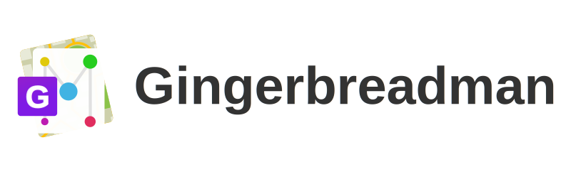

# Gingerbreadman

  
GUI Tools for Face tacking & Analyze attributes

## Dependencies

- Docker

- docker-compose

- nvidia-docker (when GPU environment)

## Let's start

Just three steps.

### 1. Clone this repository

```sh
git clone https://github.com/kekeho/gingerbreadman && cd gingerbreadman
```

### 2. Build

#### CPU

```sh
docker-compose build
```

#### GPU

```sh
docker-compose -f docker-compose-gpu.yml build
```

### 3. Launch containers

#### CPU

```sh
docker-compose up
```

#### GPU

```sh
docker-compose -f docker-compose-gpu.yml up
```

and, open browser [http://localhost:8080](http://localhost:8080)

## Warnings

- **DO NOT BUILD SERVER** of Gingerbreadman.
    This project using non-secure architecture.  
    Please don't open your NAT's port.

## License

GPLv3 [View license file](./LICENSE)
